# 📦 Box Classification & Stack Assignment System

[](https://openjdk.java.net/projects/jdk/21/)
[](https://www.docker.com/)
[](https://gradle.org/)
[](https://junit.org/junit5/)
[](#-code-coverage)

An intelligent classification system that analyzes **box measurements** (length, width, height) and **weight** to determine the appropriate **stack type** for warehouse operations. The system implements a two-stage classification algorithm: first categorizing boxes by their physical properties, then assigning them to specific stacks based on handling requirements.

## 📋 Table of Contents

- [System Overview](#-system-overview)
- [Classification Algorithm](#-classification-algorithm)
- [Project Structure](#-project-structure)
- [Quick Start](#-quick-start)
- [Runtime](#-runtime)
- [Running Tests](#-running-tests)
- [Code Coverage](#-code-coverage)
- [System Usage](#-system-usage)
- [Algorithm Details](#-algorithm-details)
- [Client Interfaces](#-client-interfaces)
- [Development](#-development)

## 🎯 System Overview

### Input → Classification → Stack Assignment

The system takes **box measurements as input** and produces **stack assignments as output** through a two-stage classification process:

**📥 Input:** Box dimensions (length × width × height in cm) + weight (in grams)  
**📤 Output:** Stack assignment (STANDARD, SPECIAL, or REJECTED)

### Stage 1: Box Classification

Boxes are first classified into categories based on their physical properties:

| Classification | Criteria |
|----------------|----------|
| **📏 BULKY** | Any dimension ≥ 150 cm **OR** volume ≥ 1,000,000 cm³ |
| **⚖️ HEAVY** | Weight ≥ 20 kg (20,000 grams) |
| **📄 STANDARD** | Neither bulky nor heavy |

### Stage 2: Stack Assignment

Based on classification results, boxes are assigned to stacks:

| Stack Type | Assignment Rule | Handling Requirements |
|------------|----------------|----------------------|
| **🚫 REJECTED** | BULKY **AND** HEAVY | Cannot be processed - requires special handling |
| **⭐ SPECIAL** | BULKY **OR** HEAVY (not both) | Requires specialized equipment or procedures |
| **✅ STANDARD** | Neither bulky nor heavy | Standard processing workflow |

### Algorithm Examples

| Box Dimensions | Weight | Classification | Stack Assignment | Reason |
|----------------|--------|----------------|------------------|--------|
| 100×50×30 cm | 10 kg | STANDARD | STANDARD | Normal size and weight |
| 150×50×30 cm | 10 kg | BULKY | SPECIAL | Oversized dimension |
| 100×50×30 cm | 25 kg | HEAVY | SPECIAL | Exceeds weight limit |
| 150×50×30 cm | 25 kg | BULKY | REJECTED | Both oversized and overweight |
| 100×100×100 cm | 15 kg | BULKY | SPECIAL | Volume = 1,000,000 cm³ |

## 🔄 Classification Algorithm

### Classification Decision Flow

```mermaid
flowchart TD
    A["📦 Box Input<br/>L×W×H cm, Weight kg"] --> B{"📏 Any dimension ≥ 150cm?"}
    B -->|Yes| C["🏷️ BULKY"]
    B -->|No| D{"📊 Volume ≥ 1,000,000 cm³?"}
    D -->|Yes| C
    D -->|No| E{"⚖️ Weight ≥ 20kg?"}
    E -->|Yes| F["🏷️ HEAVY"]
    E -->|No| G["🏷️ STANDARD"]
    
    C --> H{"⚖️ Also HEAVY?"}
    F --> I{"📏 Also BULKY?"}
    G --> J["✅ STANDARD Stack<br/>Normal processing"]
    
    H -->|Yes| K["🚫 REJECTED Stack<br/>Cannot process"]
    H -->|No| L["⭐ SPECIAL Stack<br/>Special handling"]
    I -->|Yes| K
    I -->|No| L
```



### Technical Requirements

**Runtime Options:**
- **🐳 Docker Runtime** - Containerized execution (recommended)
  - Docker 20.10+ and Docker Compose 2.0+
  - Zero local Java dependencies
  - Production-ready deployment

- **☕ Local Development** - Requires the Java stack
  - Java 21 LTS - Long Term Support version
  - Gradle 8.10+ - Build automation

**Development Stack:**
- **JUnit 5** - Testing framework
- **JaCoCo** - Code coverage analysis
- **Immutable Design** - All classes are immutable
- **Factory Pattern** - Centralized object creation
- **Comprehensive Testing** - 97%+ code coverage

## 🏗️ Project Structure

```
src/
├── main/java/ai/thoughtful/platform/factory/
│   ├── PackageClassification.java    # Classification types (BULKY, HEAVY, STANDARD)
│   ├── PackageFactory.java           # Main API for box classification
│   ├── StackType.java               # Stack assignments (STANDARD, SPECIAL, REJECTED)
│   └── model/
│       ├── Package.java             # Box representation with measurements
│       └── PackageDimension.java    # Dimension calculations and validation
└── test/java/ai/thoughtful/platform/factory/
    ├── PackageClassificationTest.java  # Tests classification algorithm
    ├── PackageFactoryTest.java         # Tests main API functionality
    ├── StackTypeTest.java             # Tests stack assignment logic
    └── model/
        ├── PackageTest.java           # Tests box behavior
        └── PackageDimensionTest.java  # Tests dimension calculations
```

## 🧠 Core Components

### System Architecture

1. **🏭 Classification Engine**
   - Analyzes box measurements against BULKY/HEAVY criteria
   - Validates input parameters (positive dimensions and weight)
   - Central entry point for box analysis

2. **📦 Box Representation**
   - Immutable data structure containing measurements
   - Automatically calculates volume (L × W × H)
   - Provides classification and stack assignment

3. **📐 Dimension Handler**
   - Validates dimensional constraints
   - Performs volume calculations
   - Checks dimensional thresholds

4. **🏷️ Classification Results**
   - `BoxClassification`: BULKY, HEAVY, STANDARD
   - `StackAssignment`: REJECTED, SPECIAL, STANDARD

## 🚀 Quick Start

### Prerequisites

**Choose your preferred runtime environment:**

#### Option 1: Local Development
- **Java 21** (LTS version)
- **Gradle 8.10+** (or use the included wrapper)

#### Option 2: Docker Runtime (Recommended for testing the CLI)
- **Docker** (20.10+ recommended)
- **Docker Compose** 

## 🐳 Runtime

### Docker Compose Usage (Recommended)

The system provides a **containerized runtime** that eliminates the need for local Java installation, making it perfect for **cloud-native deployments** and **zero-dependency execution**.

#### Build the Container
```bash
# Build the Docker image
docker compose build
```
* Build params are specified in docker-compose.yaml


#### Run Package Classification

**Basic Usage:**
```bash
# Show help documentation
docker compose run --rm sorter --help

# Classify a standard package
docker compose run --rm sorter "50,30,20,5000"
# Output: STANDARD
```

**Classification Examples:**
```bash
# Standard package (normal size and weight)
docker compose run --rm sorter "50,30,20,5000"
# Output: STANDARD

# Bulky package (oversized dimension)
docker compose run --rm sorter "150,50,30,10000"
# Output: SPECIAL

# Heavy package (exceeds weight threshold)
docker compose run --rm sorter "50,30,20,25000"
# Output: SPECIAL

# Rejected package (both bulky and heavy)
docker compose run --rm sorter "150,50,30,25000"
# Output: REJECTED

# Bulky by volume (100³ = 1,000,000 cm³)
docker compose run --rm sorter "100,100,100,15000"
# Output: SPECIAL
```

#### Advanced Docker Usage


**Container Information:**
- **Base Image**: Alpine Linux with OpenJDK 21 JRE
- **Image Size**: ~180MB (optimized multi-stage build)
- **Startup Time**: 2-3 seconds (cold start)
- **Memory Usage**: ~150MB (with container memory limits)
- **Security**: Non-root user execution (UID 1001)

#### Benefits of Docker Runtime

✅ **Zero Java Dependencies**: No local JDK/JRE installation required  
✅ **Consistent Environment**: Same behavior across all platforms  
✅ **Quick Setup**: From zero to running in 30 seconds  
✅ **Production Ready**: Optimized for containerized deployments  
✅ **Cloud Native**: Ready for Kubernetes and orchestration platforms  

### Traditional Gradle Runtime

For local development with Java stack:

```bash
# Show help
./gradlew runCli

# Classify packages
./gradlew sort -Pargs="50,30,20,5000"
./gradlew sort -Pargs="150,50,30,25000"

# Build standalone JAR
./gradlew buildCli
java -jar build/libs/packages-factory-1.0-SNAPSHOT.jar "50,30,20,5000"
```

See [CLI_USAGE.md](CLI_USAGE.md) for complete CLI documentation.

## 🧪 Running Tests

### Test Execution

```bash
# Run all tests with detailed output
./gradlew test

# Run tests with coverage report
./gradlew testWithCoverage

# Run specific test class
./gradlew test --tests "*PackageFactoryTest"

# Run tests matching pattern
./gradlew test --tests "*Test" --info
```

### Test Categories

The test suite covers:

- ✅ **Classification Tests** - Verify BULKY/HEAVY/STANDARD rules
- ✅ **Stack Assignment Tests** - Verify STANDARD/SPECIAL/REJECTED logic
- ✅ **Boundary Tests** - Test threshold values (150 cm, 20 kg, 1M cm³)
- ✅ **Volume Calculation Tests** - Verify mathematical accuracy
- ✅ **Input Validation Tests** - Test error handling for invalid inputs
- ✅ **Edge Case Tests** - Test corner cases and extreme values

### Sample Test Output

```
> Task :test

PackageClassification Tests > Bulky Package Tests > Should classify as bulky when any dimension is >= 150cm > [1] 150, 10, 10, 5000 PASSED
PackageFactory Tests > Business Logic Tests > Should create bulky package by dimension PASSED
StackType Tests > Special Stack Tests > Should classify stack as SPECIAL for bulky or heavy packages PASSED

BUILD SUCCESSFUL in 2s
119 tests completed, 119 passed
```

## 📊 Code Coverage

### Coverage Reporting

```bash
# Generate coverage report with console output
./gradlew test jacocoTestReport

# Verify coverage meets threshold (80%)
./gradlew jacocoTestCoverageVerification
```

### Current Coverage Metrics

```
📊 CODE COVERAGE REPORT
================================================================================

📄 INDIVIDUAL FILE COVERAGE:
--------------------------------------------------------------------------------
Class                                              Instructions     Branches        Lines
--------------------------------------------------------------------------------
ai.thoughtful.platform.factory.model.PackageFactory  81.3% (13/16)          N/A  66.7% (2/3)
ai.thoughtful.platform.factory.StackType             96.4% (54/56)  83.3% (5/6)  92.9% (13/14)
ai.thoughtful.platform.factory.PackageClassification 100.0% (53/53) 100.0% (10/10) 100.0% (11/11)
ai.thoughtful.platform.factory.model.PackageDimension 100.0% (32/32) 100.0% (6/6) 100.0% (4/4)
ai.thoughtful.platform.factory.model.Package          100.0% (22/22) 100.0% (2/2) 100.0% (4/4)
--------------------------------------------------------------------------------

📊 OVERALL SUMMARY:
📋 Instructions: 97.2% (174/179)
🌿 Branches:     95.8% (23/24)
📄 Lines:       94.4% (34/36)
```

### Coverage Reports

- **Console Report** - Immediate feedback during build
- **HTML Report** - `build/reports/jacoco/test/html/index.html`
- **XML Report** - `build/reports/jacoco/test/jacocoTestReport.xml`

## 💡 System Usage

### Input/Output Examples

The system processes box measurements and returns stack assignments:

## :alien: API Usage Examples

**Example 1: Standard Box (Larger but within limits)**

Let's first create a Package.

```java
// 1. Create package using fluent API
Package box = PackageFactory.builder()
    .withLengthInCm(50)
    .withWidthInCm(30) 
    .withHeightInCm(20)
    .withMassInGrams(5000)
    .build();
```

Then, we can classify it with the API.

```java
// 2. Get classification using static method
EnumSet<PackageClassification> classification = PackageClassification.classify(box);
// Result: Empty set (STANDARD = no classifications)
```

Finally, we can get the sort type.

```java
// 3. Determine stack assignment using static method
StackType stackAssignment = StackType.sort(box);
// Result: "STANDARD" (normal processing)
```

### API Examples

**Example 2: Standard Box (Larger but within limits)**

> [!TIP]
> * Note that you can use the inputs directly to the StackType.

```java
// 3. Determine stack assignment using static method
String stackAssignment = StackType.sort(60, 40, 80, 15000); // width, height, length, mass
// Result: "STANDARD" (normal processing)
```

**Example 3: Standard Box (Near threshold) - Fluent API**

```java
// 1. Create package using fluent API - any order is fine!
Package box = PackageFactory.builder()
    .withMassInGrams(19999)      // Can set mass first
    .withHeightInCm(99)          // Then height
    .withWidthInCm(99)           // Then width  
    .withLengthInCm(99)          // Finally length
    .build();                    // Build validates all properties are set

// 2. Get classification using static method
EnumSet<PackageClassification> classification = PackageClassification.classify(box);
// Result: Empty set (all dimensions < 150cm, weight < 20kg, volume = 970,299 cm³)

// 3. Determine stack assignment using static method
String stackAssignment = StackType.sort(99, 99, 99, 19999); // width, height, length, mass
// Result: "STANDARD" (normal processing)
```

#### Special Handling Examples

**Example 1: Bulky by Dimension**

```java
// 1. Create package using factory
Package box = PackageFactory.make(150, 10, 10, 5000); // width, height, length, mass in grams

// 2. Get classification using static method
EnumSet<PackageClassification> classification = PackageClassification.classify(box);
// Result: Contains BULKY (length = 150cm ≥ threshold)

// 3. Determine stack assignment using static method
String stackAssignment = StackType.sort(150, 10, 10, 5000);
// Result: "SPECIAL" (bulky but not heavy)
```

**Example 2: Heavy Package**

```java
// 1. Create package using factory
Package box = PackageFactory.make(10, 10, 10, 25000); // width, height, length, mass in grams

// 2. Get classification using static method
EnumSet<PackageClassification> classification = PackageClassification.classify(box);
// Result: Contains HEAVY (weight = 25kg ≥ 20kg threshold)

// 3. Determine stack assignment using static method
String stackAssignment = StackType.sort(10, 10, 10, 25000);
// Result: "SPECIAL" (heavy but not bulky)
```

**Example 3: Bulky by Volume**

```java
// 1. Create package using factory
Package box = PackageFactory.make(100, 100, 100, 5000); // width, height, length, mass in grams

// 2. Get classification using static method
EnumSet<PackageClassification> classification = PackageClassification.classify(box);
// Result: Contains BULKY (volume = 1,000,000 cm³ ≥ threshold)

// 3. Determine stack assignment using static method
String stackAssignment = StackType.sort(100, 100, 100, 5000);
// Result: "SPECIAL" (bulky but not heavy)
```

#### Rejected Processing Examples

**Example 1: Both Bulky and Heavy**

```java
// 1. Create package using factory  
Package box = PackageFactory.make(150, 150, 150, 25000); // width, height, length, mass in grams

// 2. Get classification using static method
EnumSet<PackageClassification> classification = PackageClassification.classify(box);
// Result: Contains both BULKY and HEAVY

// 3. Determine stack assignment using static method
String stackAssignment = StackType.sort(150, 150, 150, 25000);
// Result: "REJECTED" (both bulky AND heavy)
```

**Example 2: Oversized Length and Heavy**

```java
// 1. Create package using factory
Package box = PackageFactory.make(200, 50, 30, 22000); // width, height, length, mass in grams

// 2. Get classification using static method
EnumSet<PackageClassification> classification = PackageClassification.classify(box);
// Result: Contains both BULKY and HEAVY (length = 200cm > 150cm, weight > 20kg)

// 3. Determine stack assignment using static method
String stackAssignment = StackType.sort(200, 50, 30, 22000);
// Result: "REJECTED" (both bulky AND heavy)
```

### API Endpoints

#### Classification API

**Function:** `classifyBox(length, width, height, weightInGrams)`

**Parameters:**
- `length` - Box length in cm (must be > 0)
- `width` - Box width in cm (must be > 0)
- `height` - Box height in cm (must be > 0)
- `weightInGrams` - Box weight in grams (must be > 0)

**Returns:** Classification result (BULKY, HEAVY, or STANDARD)

#### Stack Assignment API

**Function:** `assignStack(length, width, height, weightInGrams)`

**Parameters:** Same as classification API

**Returns:** Stack assignment (STANDARD, SPECIAL, or REJECTED)

### Error Conditions

The system validates all inputs and rejects invalid measurements:

| Invalid Input | Error Reason |
|---------------|-------------|
| Dimension ≤ 0 | Physical impossibility |
| Weight ≤ 0 | Physical impossibility |
| NaN or Infinite values | Invalid measurement |

### Volume Calculation

The system automatically calculates box volume: **Volume = Length × Width × Height**

Boxes with volume ≥ 1,000,000 cm³ are classified as BULKY even if no single dimension exceeds 150 cm.

## 📚 Algorithm Details

### Classification Rules

#### BULKY Classification

**Rule 1: Dimensional Check**
- If ANY dimension (length, width, or height) ≥ 150 cm → BULKY

**Rule 2: Volume Check**
- If total volume ≥ 1,000,000 cm³ → BULKY
- Volume = Length × Width × Height

#### HEAVY Classification

**Rule:** Weight ≥ 20,000 grams (20 kg) → HEAVY

#### STANDARD Classification

**Rule:** Box is neither BULKY nor HEAVY → STANDARD

### Stack Assignment Logic

#### Decision Matrix

| BULKY | HEAVY | Stack Assignment |
|-------|-------|------------------|
| ❌ | ❌ | STANDARD |
| ✅ | ❌ | SPECIAL |
| ❌ | ✅ | SPECIAL |
| ✅ | ✅ | REJECTED |

### Implementation Architecture

**Core Components:**
- **Input Validator:** Ensures all measurements are positive and finite
- **Classification Engine:** Applies BULKY and HEAVY rules
- **Stack Assigner:** Maps classifications to stack types
- **Result Formatter:** Returns structured classification results

**Data Flow:**
1. Receive box measurements
2. Validate input parameters
3. Calculate volume from dimensions
4. Apply classification rules
5. Determine stack assignment
6. Return result

## 🖥️ Client Interfaces

The system supports multiple client interfaces for integration and usage:

* [x] **✅ CLI** - Command-line interface for direct system interaction
* [x] **✅ Docker CLI** - Containerized CLI for zero-dependency execution
* [ ] **📋 REST API** - HTTP API for programmatic integration `(TODO)`

### CLI Interface

The CLI interface provides direct access to the box classification system through command-line operations:

**Docker CLI (Recommended):**
```bash
# Quick classification
docker compose run --rm sorter "50,30,20,5000"

# Help documentation
docker compose run --rm sorter --help
```

**Traditional CLI:**
```bash
# Gradle-based CLI
./gradlew sort -Pargs="50,30,20,5000"

# Standalone JAR
java -jar build/libs/packages-factory-1.0-SNAPSHOT.jar "50,30,20,5000"
```

See [CLI_USAGE.md](CLI_USAGE.md) for detailed usage instructions.

### Docker Runtime

The Docker CLI provides:
- **Zero Dependencies**: No Java installation required
- **Consistent Environment**: Same behavior across all platforms
- **Production Ready**: Optimized for cloud deployments
- **Quick Setup**: From zero to running in 30 seconds

### API Interface

REST API implementation is planned for future releases to enable programmatic integration with external systems.

## 🛠️ Development

### Code Quality Standards

- **Immutability** - All data structures are immutable
- **Validation** - Comprehensive input validation
- **Testing** - Minimum 95% code coverage
- **Documentation** - Javadoc for public APIs
- **Modern Java** - Uses Java 21 features (records, pattern matching)
- **Containerization** - Docker-first deployment strategy

### Build Tasks

**Docker Development:**
```bash
# Build container
docker compose build

# Test container functionality
docker compose run --rm sorter "50,30,20,5000"

# Development with auto-rebuild
docker compose build --no-cache
```

**Local Development:**
```bash
# Clean build
./gradlew clean build

# Run tests with coverage
./gradlew test jacocoTestReport

# Verify code coverage threshold
./gradlew jacocoTestCoverageVerification

# Generate all reports
./gradlew test jacocoTestReport build

# Development workflow
./gradlew testWithCoverage
```

### IDE Integration

- **IntelliJ IDEA** - Import as Gradle project
- **Eclipse** - Use Gradle plugin
- **VS Code** - Java Extension Pack + Gradle plugin

### Continuous Integration

The project is configured for CI with:
- **Container Builds**: Automated Docker image building
- **Multi-Platform Testing**: Docker and local Java environments
- **Automated Testing**: On every commit
- **Code Coverage Reporting**: Minimum 95% threshold
- **Build Verification**: Both JAR and container builds
- **Java 21 LTS Compatibility**: Long-term support version

---

## 📄 License

This project is part of a coding assessment and serves as a demonstration of:
- **Clean Code Principles** - Readable, maintainable architecture
- **Test-Driven Development (TDD)** - 97%+ code coverage
- **Modern Java Features** - Java 21 LTS with records and pattern matching
- **Comprehensive Testing Strategies** - Unit, integration, and boundary testing
- **Build Automation** - Gradle with multi-stage workflows
- **Containerization** - Docker-first, cloud-native deployment
- **Zero-Dependency Runtime** - Container-based execution

**Built with ❤️ using Java 21 LTS, Docker, and modern cloud-native practices.**

